# Assignment 2 — Ray Tracing

> **To get started:** Clone this repository:
>
>     git clone git@github.com:panuelosj/computer-graphics-csc317-A2-Ray_Tracing.git
>
> **Do not fork:** Clicking "Fork" will create a _public_ repository. If you'd
> like to use GitHub while you work on your assignment, then mirror this repo as
> a new _private_ repository:
> https://stackoverflow.com/questions/10065526/github-how-to-make-a-fork-of-public-repository-private

In this assignment you will build a small **ray tracer** in Python + NumPy. It
merges two classic computer-graphics exercises:

* **Part 1: Ray Casting** — shoot rays into a 3D scene, find where they hit
  spheres, planes and triangles, and visualise the raw geometric information.
* **Part 2: Ray Tracing** — add light. Shade each hit with the Blinn-Phong
  model, cast shadow rays, and recurse for mirror reflections.

You will implement ten short functions in `src/` (one per file). As in the previous
assignment, the backend (scene representation, JSON/STL loaders and the rendering
loops) lives in `backend/` and is **not** graded.

```
python main.py                         # render the default scene (320x180)
python main.py --height 360            # bigger; the width follows the camera
python main.py --scene data/two-spheres-and-plane.json
python main.py --part 1                # only the ray-casting buffers
python run_tests.py                    # check your work against the reference tests
```

Images are written to `out/`. `main.py` is headless by default: it never opens
a window, it only writes PNG/PPM files, so it works over SSH and in CLI.

## Learning objectives

By completing this assignment you will be able to:

* derive and implement **perspective viewing rays** from a camera model
  (eye, image plane, focal length);
* implement **ray-primitive intersection** tests — sphere (quadratic
  formula), plane (implicit form) and triangle (barycentric coordinates via
  Cramer's rule);
* resolve visibility by finding the **closest hit** among many objects;
* implement **Blinn-Phong shading** (ambient + diffuse + specular) with both
  point and directional lights;
* cast **shadow rays** and explain why a floating-point epsilon offset is
  needed to avoid self-intersection;
* render **mirror reflections** with recursive ray tracing and manage dynamic
  range by clamping.

## Prerequisite knowledge

* **Math**: 3D vectors, dot and cross products, unit vectors; solving
  quadratics (discriminants); small linear systems / barycentric coordinates.
* **Programming**: `numpy` vector arithmetic; recursion.
* **Course**: A1's image conventions — `(H, W, 3)` arrays, `[0,1]` floats vs.
  `[0,255]` bytes, and writing images to disk.

---

### Prerequisite installation and setup

This assignment ships with everything it needs. From the **root of this
repository**, create its virtual environment once:

```bash
./init.sh            # macOS / Linux
# or, on Windows (PowerShell):
.\init.ps1
```

That creates `./venv` here and installs the dependencies (`numpy`, `pillow`,
`scipy`, `polyscope`). Then activate it in every new shell:

```bash
source venv/bin/activate           # macOS / Linux
# .\venv\Scripts\Activate.ps1      # Windows
```

Each assignment has its own `venv`, so activate the one belonging to the
assignment you are working on.

## Sample results

Rendered 360 pixels tall by `python main.py --height 360` once your `src/` is
complete. The width is taken from each scene camera's own aspect ratio, so
pixels stay square — most scenes come out 640x360, and the two with a square
camera come out 360x360. This is what a correct implementation produces, so you
can compare your own renders against them directly.

**Part 1** (`--part 1`) writes false-colour buffers, which are the fastest way
to see whether your intersections are right before any shading exists:

| object id | depth | normals |
|:---:|:---:|:---:|
| 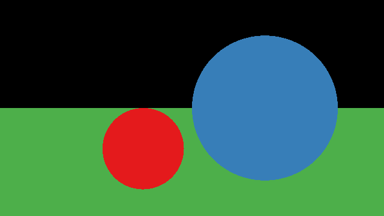 | 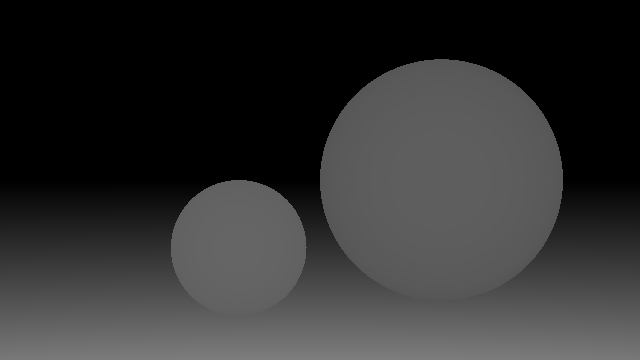 | 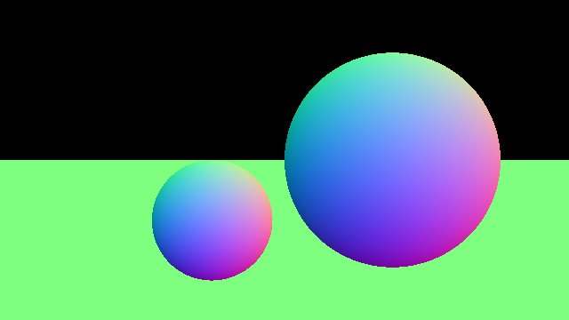 |

**Part 2** (`--part 2`) adds lighting, shadows and mirror reflections, and
writes the finished image for a scene:

| `sphere-and-plane` | `two-spheres-and-plane` |
|:---:|:---:|
|  | 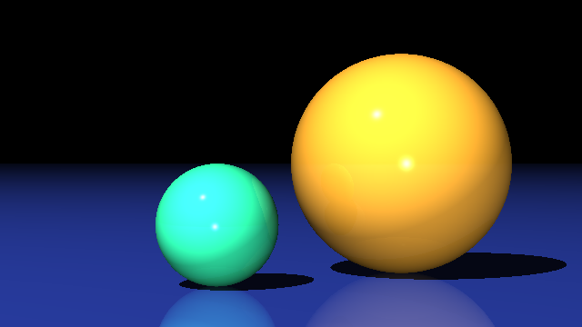 |

| `cube-and-plane` | `inside-a-sphere` |
|:---:|:---:|
| 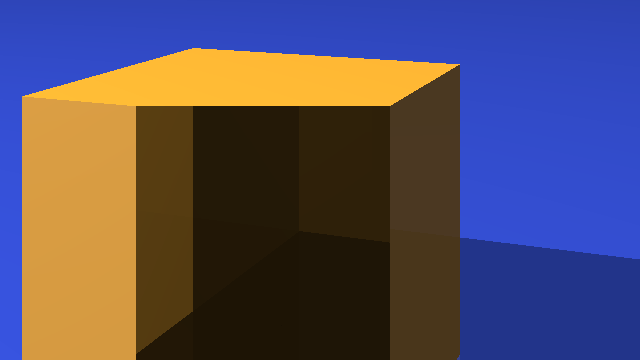 | 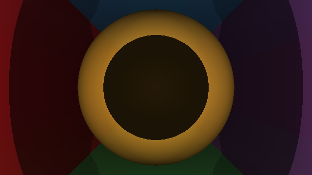 |

## Background

### Read Sections 4.1-4.4 of _Fundamentals of Computer Graphics (4th Edition)_.

_Basic shading, shadows and reflection are covered in Part 2 below._

### Scene Objects

This assignment will introduce a few _primitives_ for 3D geometry:
[spheres](https://en.wikipedia.org/wiki/Sphere),
[planes](https://en.wikipedia.org/wiki/Plane_(geometry)) and triangles. We'll
get a first glimpse that more complex shapes can be created as a collection of
these primitives.

The core interaction that we need to start visualizing these shapes is
ray-object intersection. A ray emanating from a point $\mathbf{e} \in \mathbb{R}^3$
(e.g., a camera's "eye") in a direction $\mathbf{d} \in \mathbb{R}^3$ can be
_parameterized_ by a single number $t \in [0,\infty)$. Changing the value of $t$ picks
a different point along the ray. Remember, a ray is a 1D object so we only need
this one "knob" or parameter to move along it. The [parametric
function](https://en.wikipedia.org/wiki/Parametric_equation) for a ray written
in [vector notation](https://en.wikipedia.org/wiki/Vector_notation) is:

$$
\mathbf{r}(t) = \mathbf{e} + t\mathbf{d}.
$$

For each object in our scene we need to find out:

  1. is there some value $t$ such that the ray $\mathbf{r}(t)$ lies on the
  surface of the object?
  2. if so, what is that value of $t$ (and thus what is the position of
     intersection $\mathbf{r}(t) \in \mathbb{R}^3$ )
  3. and what is the surface's [unit](https://en.wikipedia.org/wiki/Unit_vector)
     [normal vector](https://en.wikipedia.org/wiki/Normal_(geometry)) at the
     point of intersection.

For each object, we should carefully consider how _many_ ray-object
intersections are possible for a given ray (always one? sometimes two? ever
zero?) and in the presence of multiple answers choose the closest one.

> **Question:** Why keep the closest hit?
>
> **Hint:** 🤦🏻

In this assignment, we'll use simple representations for primitives. For
example, for a plane we'll store a point on the plane and the normal anywhere on
the plane.

> **Question:** How many numbers are needed to uniquely determine a plane?
>
> **Hint:** A point position (3) + normal vector (3) is too many. Consider how
> many numbers are needed to specify a line in 2D.

### Camera

In this assignment we will pretend that our "camera" or "eye" looking into the
scene is shrunk to a single 3D point $\mathbf{e} \in \mathbb{R}^3$ in space. The
image rectangle (e.g., 640 pixels by 360 pixels) is placed so the image center
is directly _in front_ of the
"eye" point at a certain ["focal
length"](https://en.wikipedia.org/wiki/Focal_length) $d$. The image of pixels is
scaled to match the given `width` and `height` defined by the `camera`. Camera
is equipped with a direction that moves left-right across the image
$\mathbf{u}$, up-down $\mathbf{v}$, and from the "eye" to the image
$-\mathbf{w}$. Keep in mind that the `width` and `height` are measure in the
units of the _scene_, not in the number of pixels. For example, we can fit a
1024x1024 image into a camera with width $=1$ and height $=1$.

**Note:** The textbook puts the pixel coordinate origin in the bottom-left, and
uses $i$ as a column index and $j$ as a row index. In this assignment; the
origin is in the _top-left_, $i$ is a _row_ index, and $j$ is a _column_ index.

> **Question:** Given that $\mathbf{u}$ points right and $\mathbf{v}$ points up,
> why does _minus_ $\mathbf{w}$ point into the scene?
>
> **Hint:** ☝️

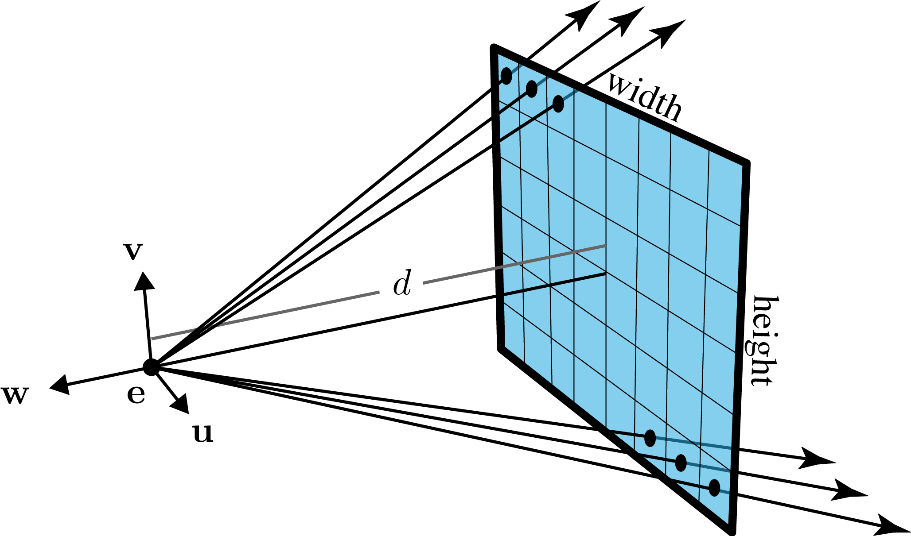

_Our [pinhole](https://en.wikipedia.org/wiki/Pinhole_camera)
[perspective](https://en.wikipedia.org/wiki/3D_projection#Perspective_projection)
camera with notation (inspired by [Marschner & Shirley 2015])._

### Triangle Soup

Triangles are the simplest 2D polygon. On the computer we can represent a
triangle efficiently by storing its 3 corner positions. To store a triangle
floating in 3D, each corner position is stored as 3D position.

A simple, yet effective and popular way to approximate a complex shape is to
store list of (many and small) triangles covering the shape's surface. If we
place no assumptions on these triangles (i.e., they don't have to be connected
together or non-intersecting), then we call this collection a "[triangle
soup](https://en.wikipedia.org/wiki/Polygon_soup)".

When considering the intersection of a ray and a triangle soup, we simply need
to find the _first_ triangle in the soup that the ray intersects first. This
assignment loads soups from `.stl` mesh files.

---

## Part 1 — Ray Casting

### False color images

Our scene does not yet have light so the only accurate rendering would be a
pitch black image. Since this is rather boring, we'll create false or pseudo
renderings of the information we computed during ray-casting.

#### Object ID image

The simplest image we'll make is just assigning each object to a color. If a
pixel's closest hit comes from the $i$-th object then we paint it with the $i$-th
rgb color in our color map.


_This "object id image" shows which object is _closest_ along the ray passing
through each pixel. Each object is assigned to its own unique color._

#### Depth images

The object ID image gives us very little sense of 3D. The simplest image to
encode the 3D geometry of a scene is a [depth
image](https://en.wikipedia.org/wiki/Depth_map). Since the range of depth is
generally $[d,\infty)$ where $d$ is the distance from the camera's eye to the camera
plane, we must map this to the range $[0,1]$ to create a [grayscale
image](https://en.wikipedia.org/wiki/Grayscale). In this assignment we use a
simple non-linear mapping based on reasonable default values.


_This grayscale "depth image" shows the distance to the nearest object along
the ray through each pixel. Shorter distances are brighter than farther
distances._

#### Normal images

The depth image technically captures all geometric information visible by
casting rays from the camera, but interesting surfaces will appear dull because
small details will have nearly the same depth. During ray-object intersection
we compute or return the surface normal vector $\mathbf{n} \in \mathbb{R}^3$ at the
point of intersection. Since the normal vector is [unit
length](https://en.wikipedia.org/wiki/Unit_vector), each coordinate value is
between $[-1,1]$. We can map the normal vector to an rgb value in a linear way
(e.g., $r = \frac12 x + \frac12$).

Although all of these images appear cartoonish and garish, together they reveal
that ray-casting can probe important pixel-wise information in the 3D scene.


_This colorized "normal image" shows surface normal at the nearest point in the
scene along the ray through each pixel._

### Functions to implement (Part 1)

> Every assignment, including this one, will contain a **Tasks** section. This will
> enumerate all of the tasks a student will need to complete for this assignment.

> Implementations of nearly any task you're asked to implemented in this course can be found 
> online. AI can also now fairly reliably accomplish these tasts. Do not copy these and avoid 
> googling for code or using AI; instead, search the internet for explanations. Many topics 
> have relevant wikipedia articles. Use these as references. Always remember to cite any 
> references in your comments.


| File | What it does |
| --- | --- |
| `src/viewing_ray.py` | Build the perspective ray through pixel `(i, j)`. At `t = 1` the ray lands on the centre of the pixel on the image plane. |
| `src/sphere_intersect.py` | Ray–sphere intersection via the quadratic formula. Take the near root; if it is closer than `min_t` you are *inside* the sphere, so use the far root. Normal is `(p - center) / radius`. |
| `src/plane_intersect.py` | Ray–plane intersection: `t = -(origin - point)·n / (direction·n)`. |
| `src/triangle_intersect.py` | Ray–triangle intersection by Cramer's rule. Require `beta ≥ 0`, `gamma ≥ 0`, `beta + gamma ≤ 1` and `t ≥ min_t`; normal is `normalize((a-b) × (a-c))`. |
| `src/first_hit.py` | Loop over every object, dispatch to the right intersection routine (including triangle soups), and return the closest hit `(hit, hit_id, t, n)`. |

---

## Part 2 — Ray Tracing

### Read Sections 4.5-4.9 of _Fundamentals of Computer Graphics (4th Edition)_.

Unlike Part 1, this [ray
tracer](https://en.wikipedia.org/wiki/Ray_tracing_(graphics)) will produce
_approximately_ accurate renderings of scenes illuminated with light.
Ultimately, the shading and lighting models here are _useful_ hacks. The basic
[recursive](https://en.wikipedia.org/wiki/Ray_tracing_(graphics)#Recursive_ray_tracing_algorithm)
structure of the program is core to many methods for rendering with [global
illumination](https://en.wikipedia.org/wiki/Global_illumination) effects (e.g.,
shadows, reflections, etc.).


_Running `python main.py --scene data/sphere-and-plane.json --part 2` should
produce this image._

### Floating point numbers

For this assignment we will use a 3-vector to represent points and vectors, but
_also_ RGB colors. For all computation (before finally writing the `.ppm` file)
we will use double precision floating point numbers and `0` will represent no
light and `1` will represent the brightest color we can display.

[Floating point
numbers](https://en.wikipedia.org/wiki/Floating-point_arithmetic) $\ne$ [real
numbers](https://en.wikipedia.org/wiki/Real_number), they don't even cover all
of the [rational numbers](https://en.wikipedia.org/wiki/Rational_number). This
creates a number of challenges in numerical method and rendering is not immune
to them. We see this in the need for a [fudge
factor](https://en.wikipedia.org/wiki/Fudge_factor) to discard ray-intersections
when computing shadows or reflections that are too close to the originating
surface (i.e., false intersections due to numerical error). In this assignment
that fudge factor is an `epsilon` of `1e-6`: a shadow or reflection ray leaving
a surface starts a tiny step away so it does not immediately, falsely,
re-intersect the surface it left.

> **Question:** If we build a ray and a plane with floating point coefficients,
> will the intersection point have floating point coefficients? What if we
> consider rational coefficients? What if we consider a sphere instead of a
> plane?
>
> **Hint:** Can we _exactly_ represent $1/3$ as a `double`? Can we represent
> $\sqrt{2}$ as a rational?


### Dynamic Range & Burning

Light obeys the [superposition
principle](https://en.wikipedia.org/wiki/Superposition_principle). Simply put,
the light reflected of some part of an objects is the _sum_ of contributions
from light coming in all directions (e.g., from all light sources). If there are
many bright lights in the scene and the object has a bright color, it is easy
for this sum to add up to more than one. At first this seems counter-intuitive:
How can we exceed 100% light? But this premise is false, the $1.0$ does not mean
the physically brightest possible light in the world, but rather the brightest
light our screen can display (or the brightest color we can store in our chosen
image format). [High dynamic range (HDR)
images](https://en.wikipedia.org/wiki/High-dynamic-range_imaging) store a larger
range beyond this usual [0,1]. For this assignment, we will simply _clamp_ the
total light values at a pixel to 1.

This issue is compounded by the problem that the [Blinn-Phong
shading](https://en.wikipedia.org/wiki/Blinn–Phong_shading_model) does not
correctly [conserve energy](https://en.wikipedia.org/wiki/Energy_conservation)
as happens with light in the physical world.

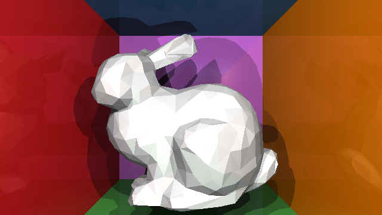

_Running `python main.py --scene data/bunny.json` should produce this image.
Notice the ["burned out"](https://en.wikipedia.org/wiki/Burned_(image)) white
regions where the collected light has been clamped to \[1,1,1\] (white)._

> **Question:** Can we ever get a pixel value _less than zero_?
>
> **Hint:** Can a light be more than off?
>
> **Side note:** This doesn't stop crafty visual effects artists from using
> "negative lights" to manipulate scenes for aesthetic purposes.


### Blinn-Phong shading

At a hit point `p` on a surface with normal `n`, the
[Blinn-Phong](https://en.wikipedia.org/wiki/Blinn–Phong_shading_model) colour is

```
rgb = 0.1 * ka                                    # ambient
    + Σ_lights  [ kd * I * max(0, n·l)            # diffuse  (Lambert)
                + ks * I * max(0, n·h)^p ]        # specular (shiny highlight)
```

summed over **only the lights that are visible** from `p`. `l` is the unit
direction to the light, `I` is the light's colour, `p` is the Phong exponent and
`h = normalize(l - normalize(ray.direction))` is the half-vector between the
light and the viewer. A light is considered visible when a shadow ray from `p` towards
the light (we usually offset by `epsilon` to avoid accidentally falling inside the object's 
surface) reaches the light without crossing any solid in our scene. We call this
a **hard shadow**. 

> **Tip:** add and debug one term at a time. Ambient by itself will look like a
> faint object-ID image. Adding diffuse gives basic shading, and specular will add
> shiny highlights. The shadow test will add dark shadows to regions occluded from
> light sources, and recursive reflection adds mirror surfaces.

### Light sources

There are many kinds of light in the real world. In this assignment, we will focus on 
two simple lighting sources:

* **Point lights** represent small light sources *inside* the scene. These will have a position `q_light`,
  and direction `q_light - q` (un-normalised so the light is reached at `t = 1`), and `max_t = 1`.
* **Directional lights** generally represent very far away light sources so that all rays
  end up parallel, with direction `light_dir` (pointing *from* the light *into* the scene).
  Direction toward the light is `-normalize(light_dir)`, and `max_t = ∞` because the light
  is infinitely far away.

### Mirror reflections (recursion)

If the hit material is mirror-like (`max(km) > 0`), trace a **reflected** ray and
add its colour weighted component-wise by `km`. The reflection of an incoming
direction `d` about a unit normal `n` is

```
reflect(d, n) = d - 2 (d·n) n
```

`raycolor` recurses on the reflected ray, capped at **10** bounces
(`MAX_RECURSIVE_CALLS` in `src/raycolor.py`) so the program always
terminates. Scenes where mirrors face each other, such as `sphere-packing`, 
will use a lot of recursive calls. Too low of a recusive limit will reduce 
the brightness of the inter-reflections.

### Debugging: render one shading term at a time

Luckily for us, our program will generate images. We can take advantage of 
the image output to try to intuit what step of our program has bugs. If our 
scene is not generating reflections, for example, we can focus our efforts at looking 
at the reflection step. 

You can use the `--stages` flag to render the scene for each term, so you can figure
out which term in the additive model is failing.

```bash
python main.py --stages --height 112                   # all five, quickly
python main.py --stages --scene data/two-spheres-and-plane.json
python main.py --stage shadows                         # just one term
```

The `--stages` flag will `out/<scene>.stages/1-ambient.png` ... `5-reflection.png`. 

| 1. ambient | 2. + diffuse | 3. + specular |
|:---:|:---:|:---:|
| 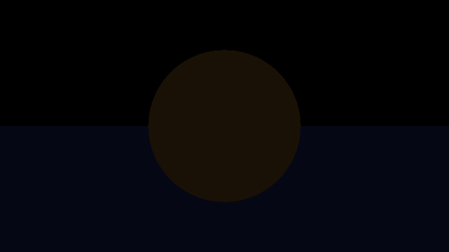 | 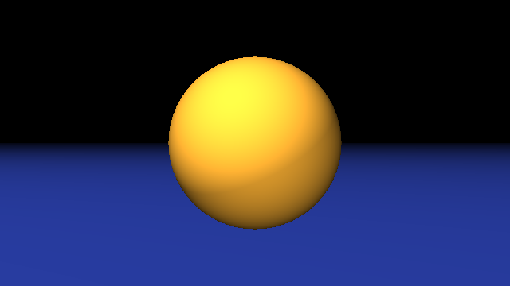 |  |

| 4. + shadows | 5. + reflection (the final image) |
|:---:|:---:|
| 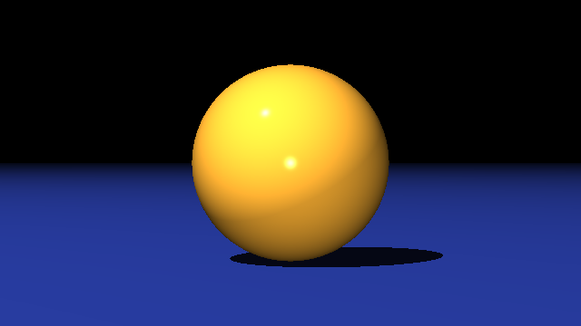 | 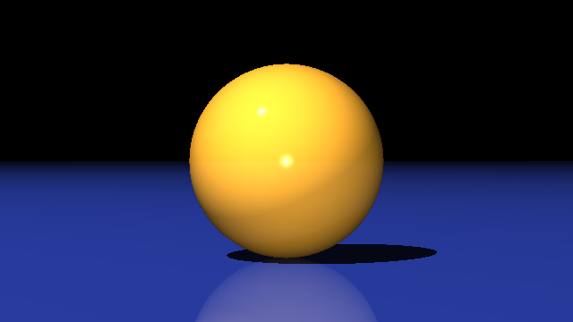 |

| first stage that looks wrong | what to go and read |
|---|---|
| **ambient** — silhouettes missing or misshapen | `viewing_ray`, the intersections, `first_hit` (try `--part 1`) |
| **diffuse** — flat, or lit from the wrong side | `n.l`, your normals, `point_light_direction` / `directional_light_direction` |
| **specular** — no highlight, or a huge dull one | the half-vector `h`, or `phong_exponent` applied to the wrong term |
| **shadows** — no shadows, or speckled black "acne" | the shadow ray's `epsilon`, or comparing `shadow_t` against `max_t` |
| **reflection** — mirrors black, or the image blows up | `reflect`, the `km` weighting, or the recursion cap |

`run_tests.py` and `check_my_work.py` will also print this same suggestion next to any
shading function that fails.

The same five passes have been rendered for **every** scene, so you can compare
against whichever one you are debugging:
[`docs/images/stages/`](docs/images/stages).

### Functions to implement (Part 2)

| File | What it does |
| --- | --- |
| `src/reflect.py` | Mirror-reflect a direction about a normal. |
| `src/point_light_direction.py` | Direction and `max_t` toward a point light. |
| `src/directional_light_direction.py` | Direction and `max_t` toward a directional light. |
| `src/blinn_phong_shading.py` | Full Blinn-Phong colour with the per-light shadow test. |
| `src/raycolor.py` | Shoot a ray, shade the hit, and recurse for mirror reflections. |

---

## Scenes (`data/`)

Scenes are JSON files describing a `camera`, a list of `materials`, a list of
`lights`, and a list of `objects` (`sphere`, `plane`, `triangle`, or `soup` with
an `stl` mesh path). A scene may also set `"accelerate": true`, which changes
speed but never the image (see below):

| scene | what it is | cost |
|---|---|---|
| `sphere-and-plane.json` | the default: an orange sphere on a slightly mirrored plane | fast |
| `two-spheres-and-plane.json` | two spheres casting shadows on a plane | fast |
| `sphere.json`, `triangle.json` | minimal single-object scenes | fast |
| `sphere-small-change.json`, `sphere-large-change.json` | one sphere, for checking a single parameter at a time | fast |
| `inside-a-sphere.json` | the camera sits inside a box of coloured planes | fast |
| `sphere-packing.json` | four mutually-reflecting tangent spheres — the scene that actually needs all 10 mirror bounces | ~25 s |
| `cube-and-plane.json` | a triangle-soup cube loaded from `cube.stl` | fast |
| `bunny.json` | a 1000-triangle mesh on a plane | slow — sets `"accelerate": true` |
| `mirror.json` | a skull in front of a mirror, three meshes | slow — sets `"accelerate": true` |

### The mesh scenes are slow

`first_hit` tests a triangle soup by checking **every** triangle, so
`bunny.json` and `mirror.json` (around a thousand triangles each, with several
lights and mirror bounces per pixel) take a very long time at full resolution.

So that you can still look at those two scenes, they set `"accelerate": true` in
their `.json`, which lets the backend skip triangles a ray cannot possibly hit
before it needs to enter your code. **Your code does not change and neither does
the image** — you still write the same loop over `geometry.triangles`. 
Every other scene, and all grading, uses the plain path.

```bash
python main.py --scene data/bunny.json                # as the scene asks
python main.py --scene data/bunny.json --no-accel     # force the slow path
```

### Renders for each scene

| `sphere` | `triangle` | `sphere-and-plane` | `two-spheres-and-plane` |
|:---:|:---:|:---:|:---:|
| 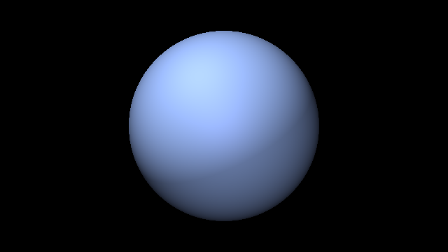 | 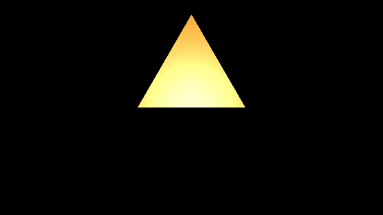 |  |  |

| `inside-a-sphere` | `cube-and-plane` | `sphere-packing` |
|:---:|:---:|:---:|
|  |  | 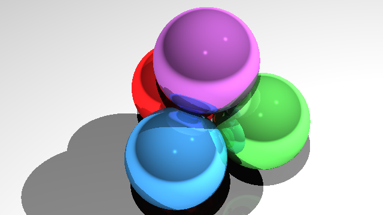 |

| `sphere-small-change` | `sphere-large-change` |
|:---:|:---:|
| 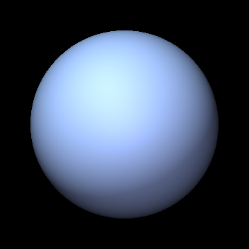 | 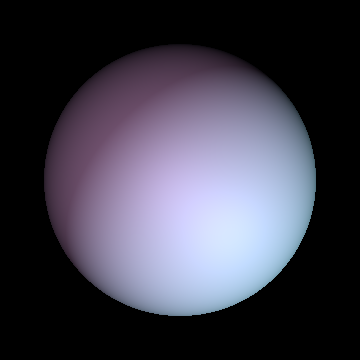 |

| `bunny` | `mirror` |
|:---:|:---:|
|  | 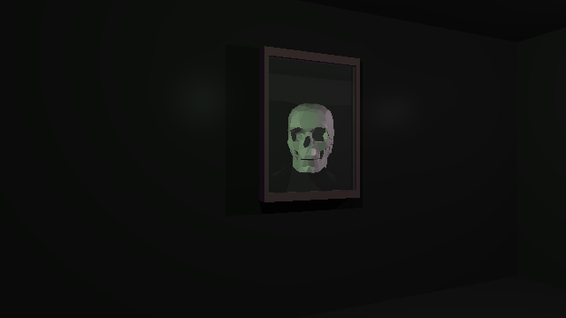 |

## Whitelist

Use NumPy for all vector math: dot product `a @ b`, cross product
`np.cross(a, b)`, length `np.linalg.norm(a)`, and **component-wise** colour
multiplication is just `a * b` on two arrays. `np.inf` is available for the
distance to a directional light.

### Checking your work

This repo ships with two tools that could potentially be useful for working on 
this assignment: `run_tests.py` and `check_my_work.py`.

```bash
python run_tests.py                  # PASS/FAIL table + "Validated X/10"
python run_tests.py --only raycolor   # focus on a single function
python check_my_work.py              # scores your implementation
```

`run_tests.py` tells you *what* is broken. `check_my_work.py` runs the same
checks but reports them as marks per function, so you can see where you stand
before submitting. Keep going until you see `Validated 10/10`. Note that the 
function only marks it against the public unit tests, we will also validate 
against internal examples that are not released in this repo. 

When a check fails and the message alone is not enough, look at the data it
used: [`tests/expected/`](tests/expected/INDEX.md) holds every input and
expected output the public tests compare against, written out as readable text
(and as `.png` images where the array is a picture).
You can also load the fixture directly:

```python
import numpy as np
g = np.load("tests/golden/a2_golden.npz")
print(g.files)        # every array the tests use
g["<name>"]           # one of them
```

When a check that compares **images** fails, it also writes a visual
comparison next to your work:

```
out/test_diffs/<function>.got.png        what your code produced
out/test_diffs/<function>.expected.png   what was expected
out/test_diffs/<function>.diff.png       where they differ (brighter = worse)
```

and the failure message names how many pixels differ, by how much, and the
first one that does. This is usually enough to recognise the bug on sight (a whole
image slightly off is a coefficient; a few edge pixels is a boundary case; a
mirrored image is an index order).

## Grading

`python run_tests.py` runs the same unit checks the grader uses. Each of the ten
functions is checked against baked-in golden values (exact-ish numeric
comparisons for the geometry/lighting functions, and a small rendered image
compared within tolerance for `blinn_phong_shading` and `raycolor`).

| File | Marks |
| ---- | ----: |
| `src/sphere_intersect.py` | 14 |
| `src/blinn_phong_shading.py` | 14 |
| `src/viewing_ray.py` | 12 |
| `src/plane_intersect.py` | 12 |
| `src/first_hit.py` | 12 |
| `src/raycolor.py` | 10 |
| `src/triangle_intersect.py` | 8 |
| `src/reflect.py` | 6 |
| `src/point_light_direction.py` | 6 |
| `src/directional_light_direction.py` | 6 |

**Total: 100 marks.**

Your `src/*.py` files are graded by these same checks, as well as additional 
internal examples. Submit only your `src/` directory (all the `.py` files inside 
the folder). Do not modify `tests/` or `backend/`.

### How your mark is computed

Each function's marks are split between two sets of tests:

| | share | what it is |
|---|---:|---|
| **public** | 30% | the tests in `tests/` that ship with this assignment — the ones `run_tests.py` and `check_my_work.py` run, whose inputs and expected outputs you can read in `tests/expected/` |
| **private** | 70% | the *same* checks run against a different set of inputs |

Both tests are run in the same way, just with different data. Note that the public
test data should be sufficient to fully test your code, the private tests are just
to avoid code that simply reproduces the published numbers but does not actually 
implement the functions asked.

### Submission

Submit your completed homework on MarkUs. Open the [MarkUs](https://markus.teach.cs.toronto.edu/markus) course
page and submit all the `.py` files in your `src/` directory under
Assignment 2: Ray Tracing.

### Questions?

Direct your questions to the [Issues page of this
repository](https://github.com/panuelosj/computer-graphics-csc317-A2-Ray_Tracing/issues).

### Answers?

Help your fellow students by answering questions or positions helpful tips on
[Issues page of this
repository](https://github.com/panuelosj/computer-graphics-csc317-A2-Ray_Tracing/issues).
